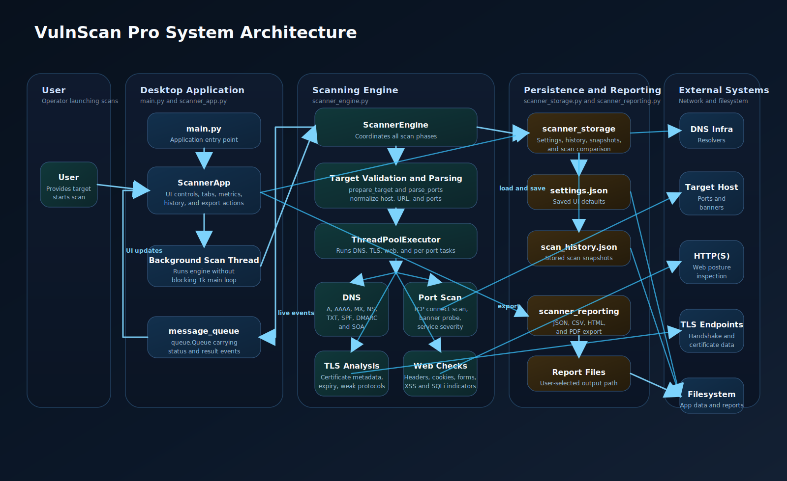
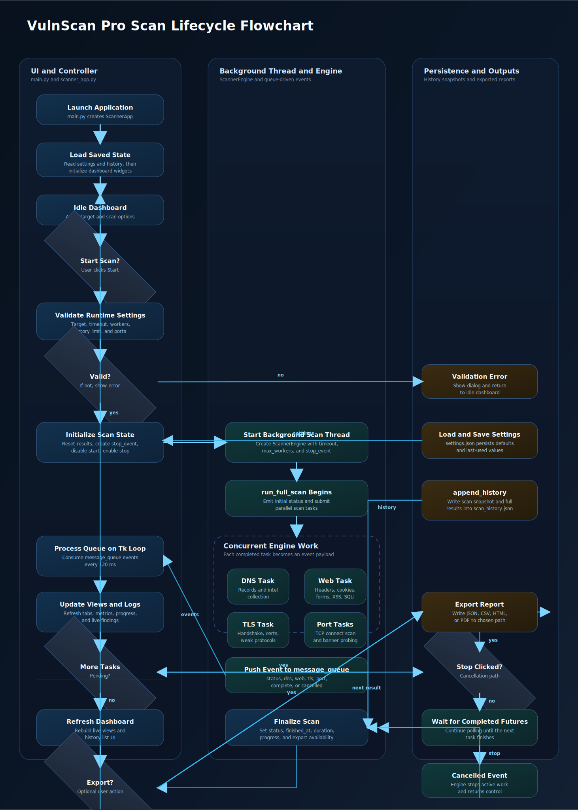

# VulnScan Pro

VulnScan Pro is a desktop vulnerability scanner built with Python and `customtkinter`.
It combines TCP port scanning, DNS lookups, TLS inspection, passive web analysis,
lightweight active web vulnerability checks, scan history, rich scan metadata, and
report export in a single desktop app.

## Features

- Desktop interface with live progress, logs, and safe cancellation
- Port presets and custom port ranges
- Concurrent DNS, port, TLS, and web scanning
- Banner probing for common services
- Passive web analysis for redirects, response headers, security headers, cookies, forms, and parameters
- Active XSS probing with multiple payloads across attribute, tag, text, and script contexts
- Active SQL injection probing with error-based, boolean-based, and time-based heuristics
- History snapshots and scan comparison
- Headless CLI mode for repeatable scans and evaluation runs
- Reproducibility metadata embedded in saved scan results and exported reports
- Export to `JSON`, `CSV`, `HTML`, and `PDF`

## Architecture



## Scan Flow



## Project Layout

```text
.
├── build_release.py
├── benchmark_lab.py
├── benchmark_metrics.py
├── benchmark_runner.py
├── benchmarks/
│   ├── apps/
│   ├── docker-compose.yml
│   ├── README.md
│   └── targets.json
├── docs/
│   ├── scan-flowchart.svg
│   └── system-architecture.svg
├── main.py
├── pyproject.toml
├── requirements-dev.txt
├── requirements.txt
├── scanner_app.py
├── scanner_cli.py
├── scanner_engine.py
├── scanner_metadata.py
├── scanner_reporting.py
├── scanner_session.py
├── scanner_storage.py
├── tests/
│   ├── test_scanner_cli.py
│   ├── test_benchmark_metrics.py
│   ├── test_benchmark_runner.py
│   ├── test_scanner_engine.py
│   ├── test_scanner_reporting.py
│   ├── test_scanner_session.py
│   └── test_scanner_storage.py
└── README.md
```

## Modules

- `main.py`: starts the desktop application or delegates to the CLI mode when arguments are supplied
- `benchmark_lab.py`: starts and stops the controlled local benchmark lab
- `benchmark_runner.py`: runs VulnScan Pro and optional baseline tools against benchmark targets
- `benchmark_metrics.py`: computes precision, recall, false positives, and average scan duration from benchmark runs
- `scanner_app.py`: UI, scan controls, queue handling, history view, and export actions
- `scanner_cli.py`: headless scan runner for repeatable and scriptable experiments
- `scanner_engine.py`: target parsing, DNS checks, port scanning, TLS checks, and context-aware web checks
- `scanner_metadata.py`: runtime metadata helpers for reproducibility and reporting
- `scanner_session.py`: shared scan payload helpers used by the GUI and CLI
- `scanner_storage.py`: settings, history, snapshots, and comparison helpers
- `scanner_reporting.py`: report generation for `JSON`, `CSV`, `HTML`, and `PDF`

## Installation

```bash
python3 -m venv .venv
source .venv/bin/activate
pip install -r requirements.txt
```

Or install the project in editable mode:

```bash
pip install -e .
```

Optional build dependencies:

```bash
pip install -r requirements-dev.txt
```

## Run

```bash
python3 main.py
```

Or with the local virtual environment:

```bash
.venv/bin/python main.py
```

Headless CLI mode for repeatable experiments:

```bash
python3 main.py scan https://example.com --ports web --format html --output reports/example.html
```

Or print the full JSON result to stdout:

```bash
python3 scanner_cli.py example.com --ports common --print-json
```

## Benchmark Workflow

Start the controlled benchmark lab:

```bash
python3 benchmark_lab.py up
```

Run a benchmark pass with VulnScan Pro and any installed baselines:

```bash
python3 benchmark_runner.py --skip-missing-tools
```

Recompute evaluation metrics for a saved run:

```bash
python3 benchmark_metrics.py benchmarks/results/run_YYYYMMDD_HHMMSS
```

The local benchmark fixtures and target definitions live in `benchmarks/`.

## Usage

1. Enter a target IP, domain, or URL.
2. Choose a preset such as `common`, `top100`, `web`, `database`, `mail`, or `remote`.
3. Optionally enter custom ports such as `1-1024,8080,8443`.
4. Set timeout, worker count, and export format.
5. Click `Start Scan`.
6. Review results in `Overview`, `Ports`, `Web`, `Intel`, `History`, and `Settings`.
7. Click `Stop` to cancel an active scan.
8. Export the current scan when needed.

Benchmark workflow in the GUI:

- Open the `Benchmark` tab to review target definitions, control the local lab, run benchmark passes, and inspect evaluation summaries.
- The benchmark runner uses the current timeout and worker values from the main control strip.
- After a benchmark run completes, the GUI records the active run directory so you can re-evaluate it later from the same tab.

Port input examples:

- `common`
- `top100`
- `web`
- `21,22,80,443`
- `1-1024`
- `1-1024,8080,8443`

## Web Analysis Coverage

The built-in web scanner combines passive checks with lightweight active probing:

- Passive checks collect redirect chains, response headers, common security headers, cookie flags, forms, and injectable parameters.
- XSS checks use multiple reflected payloads designed for different HTML contexts, then inspect where the payload appears before reporting a likely issue.
- SQL injection checks combine database error detection with boolean-response comparison and time-delay heuristics.

Current scope and limits:

- Active web probes currently focus on URL query parameters and discovered `GET` form inputs.
- Results are indicators intended to help triage likely issues, not proof of exploitability.
- The scanner does not execute JavaScript in a real browser, so DOM-only XSS and complex client-side flows are out of scope.
- Authenticated workflows, CSRF-protected forms, custom headers, JSON bodies, and multi-step application logic are not deeply exercised.

## Data and Output

- Settings are stored in `~/.vulnscan_pro/settings.json`
- Scan history is stored in `~/.vulnscan_pro/scan_history.json`
- Reports can be exported as `JSON`, `CSV`, `HTML`, or `PDF`
- Saved scans and reports now include scanner version, runtime metadata, dependency versions, scan configuration, and recorded errors

## Testing

```bash
python3 -m unittest discover -s tests -v
```

Continuous integration is configured in `.github/workflows/tests.yml`.

## Packaging

```bash
python3 build_release.py
```

The project also includes `pyproject.toml` so it can be installed and scripted as a standard Python package.

## Notes

- Web findings should be treated as strong indicators for manual verification, not as a full web application penetration test.
- DNS collection is skipped for IP-only targets.
- TLS analysis depends on a reachable TLS service.
- Some open services may not return useful banners.

## Authorized Use

Use this tool only on systems and networks you own or are explicitly authorized to assess.
